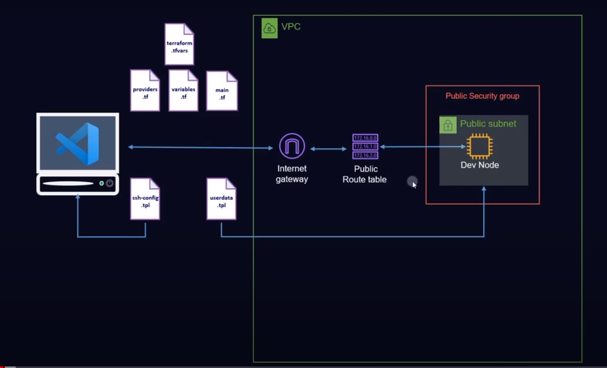

Gen ssh key

```sh
ssh-keygen -t ed25519
```

Common command

```sh
terraform init

terraform fmt

terraform plan

terraform validate

terraform state list


```

Reference:

- https://www.youtube.com/watch?v=iRaai1IBlB0
